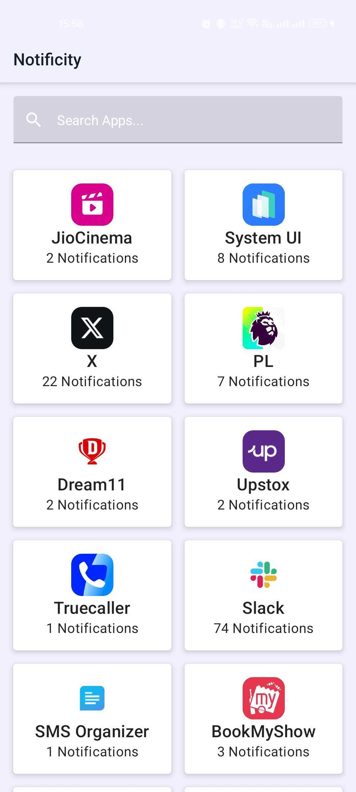
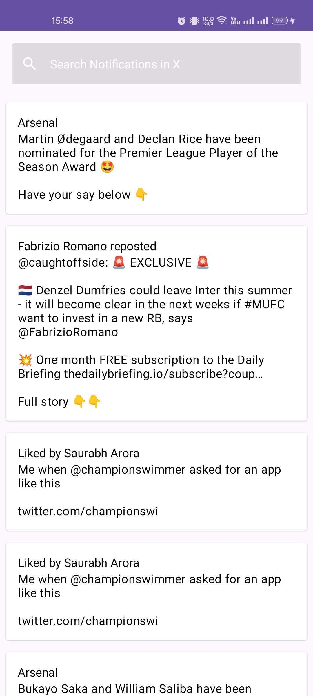

# Notificity

Notificity is an Android application designed to capture and categorize all incoming push notifications. 
It provides users with the ability to search through notifications both at the application level and using specific keywords. 
This project aims to enhance user productivity and notification management on Android devices.

## Features

- **Notification Listener**: Captures all incoming push notifications in real-time.
- **Database Storage**: Stores details such as the notification title, content, timestamp, and originating application using Room DB.
- **Search Functionality**: Enables users to search notifications by application or by specific keywords within the notifications.
- **UI Design**: Utilizes Material Design & Jetpack Compose for a modern and intuitive user interface.
- **Category Management**: Notifications are categorized by application, allowing for organized viewing.

## Screenshots




## Installation

Follow these steps to set up the project locally:

1. Clone the repository:
   ```bash
   git clone https://github.com/darshanpania/notificity.git
   ```
2. Open the project in Android Studio or any compatible IDE.
3. Sync the project with Gradle to resolve all dependencies.
4. Run the app on an Android emulator or a physical device.

## Usage

After installation, you will need to grant the application permission to access notifications:

Navigate to: Settings -> Apps & Notifications -> Special App Access -> Notification access, and enable access for Notificity.
Relaunch the application and start managing your notifications more effectively.

## Contributing

See our [Contribution Guidelines here](CONTRIBUTING.md)

## Contributors

| First Contributor | [Avadhut Tanugade](https://github.com/mrwhoknows55) |
|-------------------|-----------------------------------------------------|


## License

This project is licensed under the MIT License - see the [LICENSE.md](LICENSE) file for details.

## Contact

Reach out to me for any issue in this app on my [Email](mailto:darshanpania.dev@gmail.com) or [Twitter](https://twitter.com/i_m_Pania) 
Feel free to open any [issues](https://github.com/darshanpania/Notificity/issues) you encounter

## Acknowledgements

Special thanks to [Arnav Gupta](https://twitter.com/championswimmer) for the idea, [Himanshu Singh](https://twitter.com/hi_man_shoe) for the initial feedback and [Sutirth Chakravarthy](https://twitter.com/Sutirth) for his moral support! 
